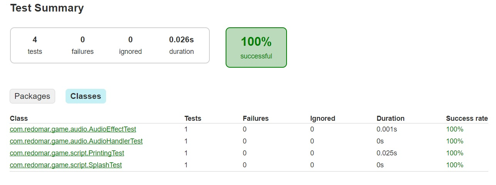
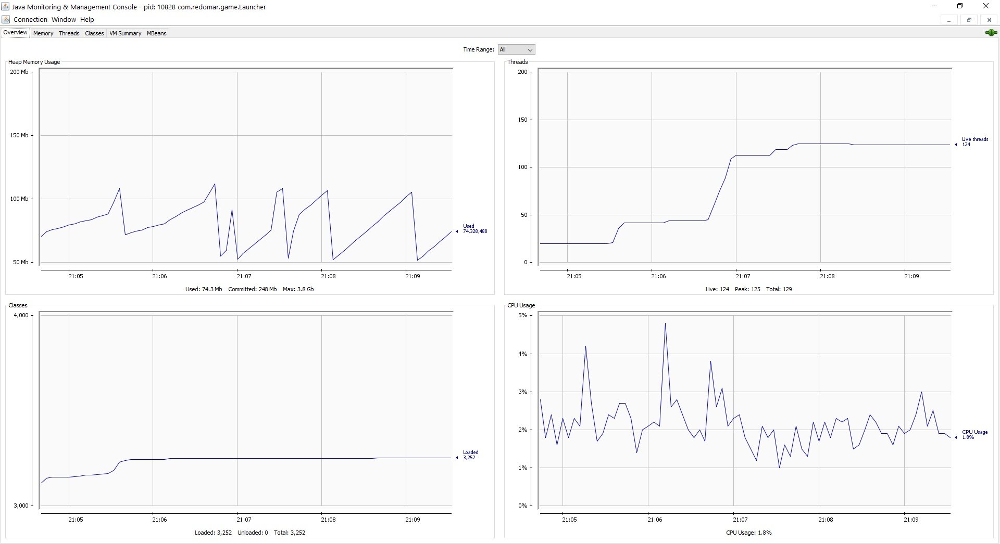
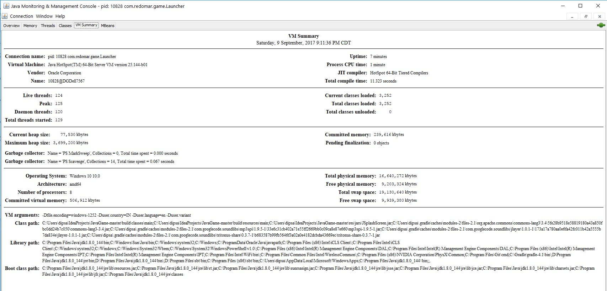
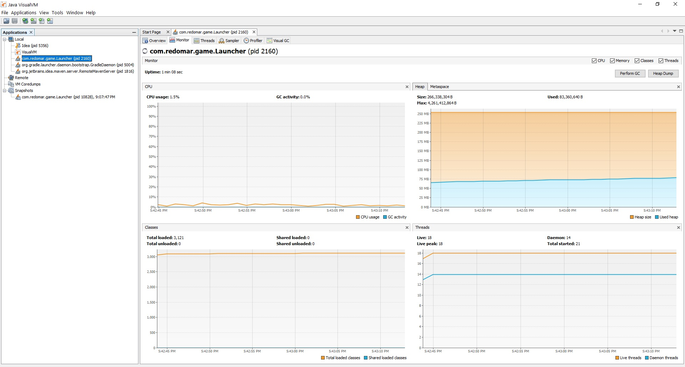
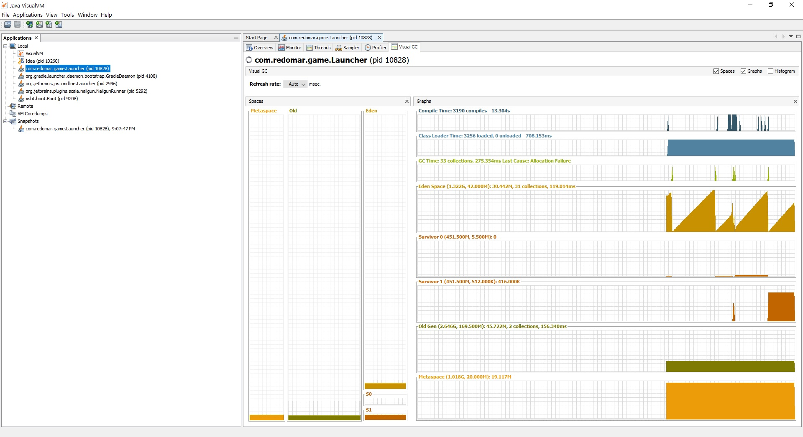
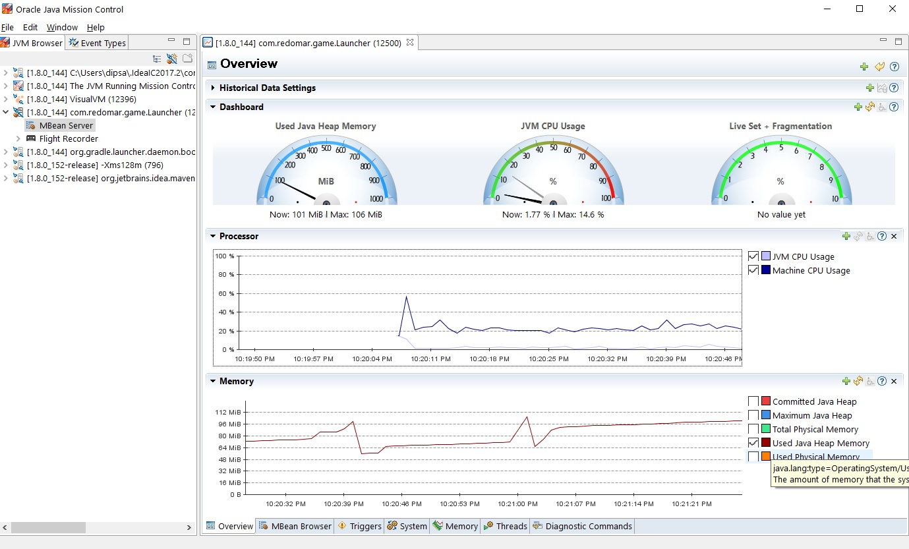

JavaGame
========

A 2D game built on Java, inspired and taken from [this](https://github.com/redomar/JavaGame) GitHub repository. I have added few additional features such as JUnit tests, and build scripts.

Pre-requisites
--------------

* JDK 8 (with environment variables set)
* IntelliJ IDEA (with JUnit, Gradle & SBT plugins enabled)
* Latest versions of Gradle & SBT

Getting Started
---------------

Clone the repository from BitBucket on your local machine (or download as zip and extract). Open the directory [JavaGame](JavaGame) from the cloned/extracted directory in IntelliJ IDEA. Make sure both Gradle and SBT plugins are working correctly in the IDE, and JVM is set (JAVA_HOME environment variable should be set). Both Gradle & SBT builds are inside the same directory. Wait for the IDE to gather resources and index the project. Once done, you are all good to go!

Testing
-------

I have included 4 JUnit test files inside the [test](JavaGame/test) directory under the project structure. The [audio](JavaGame/test/audio) tests check if the relevant audio resources are present and working. The [printing test](JavaGame/test/script/PrintingTest.java) checks if a random string can be printed correctly, along with creation/deletion of a txt file on which it can print the log. The [splash test](JavaGame/test/script/SplashTest.java) checks the splash screen image is present in the resources for smooth launch of the application. You may run them using Gradle/SBT tasks. 

**Testing with Gradle:** Open the Gradle Tool Window from the menu bar (View -> Tool Windows -> Gradle). Inside the Gradle Tool Window, go to Tasks -> build -> clean. Wait for the application to complete the task. Once done, go to Tasks -> verification -> test. It will start executing the test files from the test directory, and soon you should see *All 4 tests passed*. Under the Run window, there will be an icon with the tooltip showing *Open Gradle test report*. Click on the icon to obtain a detailed view of the test report. If you want to run the tests again, run the clean task, and then run the test task. This is snapshot of the test report:

**Testing with SBT:** Open the SBT Tool Window from the menu bar (View -> Tool Windows -> SBT). Inside the SBT Tool Window, go to javagame (not javagame-build) -> SBT Tasks -> test. Wait for the application to complete the task, and you may see the status under the SBT shell window. Once done, it should show *Passed: Total 4, Failed 0, Errors 0, Passed 4 [success]* under the SBT shell window.

Compiling & running the application
-----------------------------------

I have included run tasks in both Gradle & SBT builds, so you may use any one of them. When you start the run task, it will automatically build the application (using [build.gradle](JavaGame/build.gradle) for the Gradle task, and [build.sbt](JavaGame/build.sbt) for the SBT task), compiling all the .java files, resolving the dependencies and paths, finally launching the application from its main class [Launcher](JavaGame/src/com/redomar/game/Launcher.java), which is specified inside build.gradle/sbt.

**Launching using Gradle:** From the Gradle Tool Window, go to Tasks -> build -> build. Once build is complete, go to Tasks -> application -> run. The Splash screen will show up in a new window, and will start loading the resources. It will then ask for your name and other character details. So that’s it. You have successfully launched JavaGame! :thumbsup:

**Launching using SBT:** From the SBT Tool Window, go to javagame (not javagame-build) -> SBT Tasks -> run. The Splash screen will show up in a new window, and will start loading the resources. It will then ask for your name and other character details. So that’s it. You have successfully launched JavaGame! :thumbsup:

Debugging & Monitoring using Java Monitoring Tools
--------------------------------------------------

I have used JConsole, VisualGC, Java Mission Control, and Visual VM to monitor and debug the application and its performance. The tools gave some detailed statistics regarding the runtime CPU/memory usage, threads and classes used.

**JConsole:** I started the jconsole executable from the JDK bin directory. Under New Connection, I have selected the com.redomar.game.Launcher local process. After the connection is established, the GUI showed various usage plots, which is crucial in understanding the performance of the application. I have attached a snapshot of the Overview and VM Summary.

**Visual VM:** I started the jvisualvm executable from the JDK bin directory. Under Local Applications on the left side, I have selected the com.redomar.game.Launcher. The different tabs help in monitoring the application’s current activity along with the Compile time & Garbage Collector activity. I have attached a snapshot of the same.

**Visual GC:** I started the jvisualvm executable from the JDK bin directory. Under Local Applications on the left side, I have selected the com.redomar.game.Launcher. The different tabs help in monitoring the application’s current activity along with the Compile time & Garbage Collector activity. A detailed status can be viewed by going to the Visual GC tab. I have attached a snapshot of the Visual GC tab.

**Java Mission Control:** I started the jmc executable from the JDK bin directory. Under JVM Browser on the left pane, I have selected the com.redomar.game.Launcher -> MBean Server. Once loaded, it will show a cool dashboard of the JVM CPU/memory usage. I have attached a snapshot of the same.

